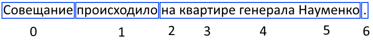

# Parser - частеречная разметка, лемматизация и синтаксический разбор

Парсер выполняет базовые задачи для текста на русском (или другом, поддерживаемом словарной базой
и моделями) языке:

* Частеречная разметка (part-of-speech tagging)  
* Построение синтаксического дерева зависимостей (dependency parsing)  
* Разбивка на глагольные/именные составляющие первого уровня (chunking)  
* Лемматизация  
* Токенизация с учетом неоднозначностей для составных слов  

## Варианты парсера

Реализованы следующие варианты парсера:

1) основной проект - консольная утилита (проект Parser)  
2) биндинг для Питона (проект PyParser, использована boost::python)  
3) HTTP REST сервис (Parser_RestHttpService, использована boost:asio)  

## Словарная база и языковые модели

Для работы Парсера необходима словарная база и файлы данных моделей, полученных
применением алгоритмов машинного обучения для больших размеченных корпусов. Готовые
файлы моделей для русского языка можно взять из [каталога в репозитории](https://github.com/Koziev/GrammarEngine/tree/master/src/bin-windows64).
Сборка русской словарной базы из [исходников](https://github.com/Koziev/GrammarEngine/tree/master/src/dictionary.src) описана
на [главной странице](https://github.com/Koziev/GrammarEngine).

Кроме того, архив с полностью готовыми файлами парсера можно взять на [сайте проекта](http://www.solarix.ru/parser.shtml).

Путь к файлу dictionary.xml словарной базы задается опцией "-d path". По умолчанию файлы
языковых моделей лежат в том же каталоге, что и сама словарная база, хотя это можно
изменить, задавая относительные пути для элементов под тегом <models> в dictionary.xml.

## Сборка из исходников для MS Windows

Под MS Windows для компиляции парсера можно использовать готовое решение для VisualStudio 2015 - файл Parser64.sln в [каталоге](https://github.com/Koziev/GrammarEngine/blob/master/src/demo/ai/solarix/argon/ParseText/Parser/Parser64.sln).
В этом решении собраны проекты для сборки консольной версии парсера (Parser) и модуля для Питона (PyParser).

Предварительно надо скачать и собрать [библиотеки Boost](http://www.boost.org). На момент
написания инструкции текущей версией Boost была 1.66, для нее процесс выглядит примерно так ([здесь](http://www.boost.org/doc/libs/1_52_0/more/getting_started/windows.html) есть
официальная дока).  

1) Скачиваем и распаковываем архив с исходниками отсюда http://www.boost.org/users/history/version_1_66_0.html.

2) Открываем консоль.

3) Возможно, потребуется инициализировать переменные среды для VisualStudio, для этого
при установленной версии 2015 запускаем
```
"c:\Program Files (x86)\Microsoft Visual Studio 14.0\VC\vcvarsall.bat" amd64
```

4) Собираем инструменты для сборки буста, для этого переходим в кореневой каталог, куда
был распакован архив буста и выполняем:
```
bootstrap.bat
```

5) Запускаем сборку библиотек буста:
```
bjam -j4 --build-type=complete architecture=x86 address-model=64 link=static stage
```

6) Далее можно скопировать собранные файлы библиотек в новый отдельный каталог, либо
линковаться с подкаталогом ...\stage\lib. В проекте сборки парсера не забудьте указать путь
к этому каталогу в свойствах линкера вместо моего значения e:\boost.1.66\stage\lib\.


## Сборка под Ubunta

Предполагается, что установлены внешние зависимости, указанные на [странице описания грамматического движка](https://github.com/Koziev/GrammarEngine).
Также необходимо собрать русскую словарную базу.

Кроме этого, необходимо выполнить следующие действия.

Установить PCRE++:
```
sudo apt-get install libpcre++-dev
```

Компилируем библиотеку для синтаксического разбора:
```
cd ~/GrammarEngine/src/demo/ai/solarix/DeSR/libdesr
./build.sh
```

Теперь можно скомпилировать сам парсер:
```
cd ~/GrammarEngine/src/demo/ai/solarix/argon/ParseText/Parser
./build.sh
```

После успешной компиляции можно запустить скрипт [parse.sh](https://github.com/Koziev/GrammarEngine/tree/master/src/scripts/Parser/parse.sh), чтобы убедится в нормальной работе
парсера.

## Установка собранного модуля pyparser

Все pyd и dll файлы, необходимые для работы с парсером в питоне, собраны в подкаталоге pyparser.
Для удобства использования в птоновском коде модуль pyparser необходимо установить
с помощью pip. Для этого перейдите внутрь каталога src репозитория (там можно увидеть файл setup.py)
и выполните 
```
pip install .
```

Далее можно запустить интерпретатор питона python и выполнить в нем следующий код:

```
from __future__ import print_function

from pyparser import PyParser

p = PyParser()
p.load(u'e:/mvoice/lem/bin-windows64/dictionary.xml', 0, -1)

tokens = p.tag1(u'кошки спят на веранде', True, False)
for token in tokens:
    print(u'{}\t{}\t{}'.format(token[0], token[1], token[2]))

```

Метод PyParser.load загружает словарную базу по указанному файлу конфигурации, поэтому
потребуется скорректировать путь. Метод PyParser.tag1 разбирает одно предложение,
переданное как юникодная строка, и возвращает список кортежей. Каждый кортеж
имеет 4 элемента: исходное слово, лемма, часть речи и список пар тег+значение для
морфологических признаков слова.

## Результаты разбора

Консольный вариант парсера сохраняет результаты разбора в указанном XML файле (если указана опция -o имя_файла) или выводит
их прямо в консоль (по умолчанию).

Например, предложение "Совещание происходило на квартире генерала Науменко." в результате
работы чанкера (опция -parser 2) даст такой результат:

```
<chunks>
 <token word_index='0' is_chunk_starter='1'/>
 <token word_index='1' is_chunk_starter='1'/>
 <token word_index='2' is_chunk_starter='1'/>
 <token word_index='3' is_chunk_starter='0'/>
 <token word_index='4' is_chunk_starter='0'/>
 <token word_index='5' is_chunk_starter='0'/>
 <token word_index='6' is_chunk_starter='1'/>
</chunks>
```

Атрибут is_chunk_starter для каждого входного слова определяет, является
ли слово первым в отдельной группе, прикрепляемой к корню:



В данном случае видно, как отдельная группа слов для предложного обстоятельства
"на квартире генерала Науменко" образует отдельную группу, в которой первое слово,
предлог "на", помечен атрибутом is_chunk_starter='1', а остальные помечены
атрибутом is_chunk_starter='0'.


## Примеры запуска консольного парсера

Парсер реализован как консольная программа. Режим обработки текста задается
аргументами командной строки.

Только частеречная разметка текста (-tagger 0) в файле (-i ...), где каждая строка соответствует одному
предложению (опция -eol):

```
parser -verbose -tagger 0 -eol -d ../ru/dictionary.xml -i input.txt -o output.xml
```

Частеречная разметка, синтаксический разбор и лемматизация:

```
parser -verbose -tagger 0 -parser 0 -lemmatizer 0 -eol -d ../ru/dictionary.xml -i input.txt -o output.xml
```

Разбивка на составляющие для текста, который надо по ходу разбора разбивать на предложения:

```
parser -verbose -tagger 0 -parser 2 -d ../ru/dictionary.xml -i input.txt -o output.xml
```

## Запуск REST сервиса

REST сервис реализован как консольное приложение. Пример командной строки для запуска:

```
Parser_RestHttpService.exe -tagger 0 -parser -1 -lemmatizer 0 -d dictionary.xml -url 127.0.0.1 -port 10973
```

Прослушиваемый сетевой адрес задается опциями -url и -port. Чтобы веб-сервис парсинга был доступен
из внешних сетей, нужно вместо -url 127.0.0.1 указать -url 0.0.0.0 или подставить
адрес конкретного сетевого интерфейса.

Назначение остальных параметров можно найти выше в описании консольного парсера.

Пример GET-запроса для выполнения разбора предложения:

```
http://127.0.0.1:10973/tag1?sent=%D0%BA%D0%BE%D1%88%D0%BA%D0%B8%20%D1%81%D0%BF%D1%8F%D1%82
```

Метод tag1 выполняет разбор одного предложения, передаваемого как параметр sent. Результат
разбора будет возвращен в JSON формате:

```
{
 "tokens":[
  {
   "word": "Толстые",
   "lemma": "толстый",
   "part_of_speech": "ПРИЛАГАТЕЛЬНОЕ",
   "tags": [  ]
  },
  {
   "word": "кошки",
   "lemma": "кошка",
   "part_of_speech": "СУЩЕСТВИТЕЛЬНОЕ",
   "tags": [  ]
  },
  {
   "word": "ловят",
   "lemma": "ловить",
   "part_of_speech": "ГЛАГОЛ",
   "tags": [  ]
  },
  {
   "word": "серых",
   "lemma": "серый",
   "part_of_speech": "ПРИЛАГАТЕЛЬНОЕ",
   "tags": [  ]
  },
  {
   "word": "мышек",
   "lemma": "мышка",
   "part_of_speech": "СУЩЕСТВИТЕЛЬНОЕ",
   "tags": [  ]
  },
  {
   "word": ".",
   "lemma": ".",
   "part_of_speech":
   "ПУНКТУАТОР", "tags": [  ]
  }
 ]
}
```

В каталоге [HttpRestClient/py](https://github.com/Koziev/GrammarEngine/tree/master/src/demo/ai/solarix/argon/ParseText/HttpRestClient/py) лежит
простой пример вызова веб-сервиса парсинга из кода на Питоне (библиотека requests).


## Тренеры моделей

Парсер использует статистические модели для лемматизации, частеречной разметки и парсинга,
обучая их на большом корпусе размеченных в ручную текстов. Исходный текст программ на C#, выполняющих
обучение, также доступен в репозитории:

[part-of-speech tagger model trainer](https://github.com/Koziev/GrammarEngine/tree/master/src/demo/ai/solarix/argon/DisambigRuleBuilder/POSTaggerDatasetBuilder)  
[chunker model trainer](https://github.com/Koziev/GrammarEngine/tree/master/src/demo/ai/solarix/argon/DisambigRuleBuilder/ShallowParserDatasetBuilder)  
[lemmatizer model trainer](https://github.com/Koziev/GrammarEngine/tree/master/src/demo/ai/solarix/argon/DisambigRuleBuilder/LemmatizerDatasetBuilder)
[dependency parsing model trainer](https://github.com/Koziev/GrammarEngine/tree/master/src/demo/ai/solarix/argon/DisambigRuleBuilder/DisambigRuleBuilder)  

Все тренеры используют текстовые корпуса, размеченные вручную, для формирования обучающего
датасета. В настоящее время поддерживаются корпуса во внутреннем формте Solarix (см. класс [SolarixBinaryCorpusReader](https://github.com/Koziev/GrammarEngine/blob/master/src/demo/ai/solarix/argon/DisambigRuleBuilder/CorporaLib/SolarixBinaryCorpusReader.cs)),
Universal Dependencies (см. класс [UniversalDependenciesCorpusReader](https://github.com/Koziev/GrammarEngine/blob/master/src/demo/ai/solarix/argon/DisambigRuleBuilder/CorporaLib/UniversalDependenciesCorpusReader.cs))
и корпус из [соревнования Диалог](https://github.com/dialogue-evaluation/morphoRuEval-2017) (см. класс [DialogMorphEvalCorpus](https://github.com/Koziev/GrammarEngine/blob/master/src/demo/ai/solarix/argon/DisambigRuleBuilder/CorporaLib/DialogMorphEvalCorpus.cs)).

### Тренировка лемматизатора

Пример запуска обучения модели лемматизации по корпусам Solarix и Universal Dependencies:

```
set SOLARIX_CORPUS=-corpus E:\Corpus\CompiledCorpus\ru\x64\*.bin
set CONLLU_CORPUS=-ud_corpus "E:\Corpus\UD_Russian-SynTagRus\*.conllu"

LemmatizerDatasetBuilder.exe -dict .\ru\dictionary.xml %CONLLU_CORPUS% %SOLARIX_CORPUS% -params LANGUAGE=ru -tmp e:\tmp
```

По окончании работы будут созданы файлы lemmatizer.model и lemmatizer.codebook.


